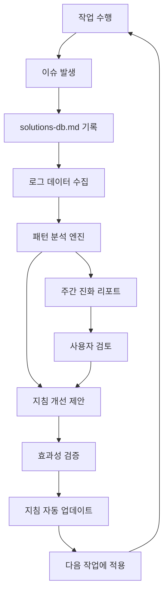

# 🧬 자기 진화형 지침 시스템 (Evolutionary Guidelines System)

> **혁신적 아이디어**: 실제 경험 + 트러블슈팅 데이터 + 로그 분석을 통해 지침이 스스로 발전하는 시스템
> **목표**: 814줄 지침을 단순히 압축하는 것이 아니라, 실제 사용 경험으로 더욱 완성도 높게 진화

---

## 🌟 **핵심 개념: 데이터 기반 지침 진화**

### **🔄 진화 사이클**
```markdown
실제 작업 → 문제 발생 → 해결 → 기록 → 패턴 분석 → 지침 개선 → 다음 작업에 적용
     ↑                                                              ↓
     ←←←←←←←←←←←←   경험 축적 및 지침 자동 업데이트   ←←←←←←←←←←←←
```

### **📊 데이터 소스 통합**
```markdown
🎯 지침 진화를 위한 3대 데이터 소스:

1. 📝 solutions-db.md (이미 구축완료)
   ├── 365줄의 체계적 이슈 기록
   ├── 재사용 가능성 별점 시스템 (⭐⭐⭐⭐⭐)
   ├── 해결 시간 추적 (15분~60분)
   └── 카테고리별 분류 체계

2. 🔍 로그 기반 디버깅 시스템
   ├── 실시간 성능 모니터링
   ├── 오류 발생 패턴 분석
   ├── 사용자 행동 데이터 수집
   └── 시스템 부하 추적

3. 📈 작업 성과 데이터
   ├── 체크리스트 완료율 통계
   ├── 지침 참조 빈도 분석
   ├── 작업 시간 효율성 측정
   └── 품질 지표 변화 추적
```

---

## 🔬 **진화 메커니즘 설계**

### **1단계: 실시간 패턴 감지**
```python
class GuidelineEvolutionAnalyzer:
    def analyze_issue_patterns(self):
        """이슈 발생 패턴 분석 및 지침 개선점 도출"""
        
        # solutions-db.md 데이터 파싱
        issues = self.parse_solutions_database()
        
        # 패턴 분석
        patterns = {
            'frequent_issues': self.find_frequent_issues(issues),
            'time_consuming_issues': self.find_time_consuming_issues(issues),
            'recurring_mistakes': self.find_recurring_mistakes(issues),
            'guideline_gaps': self.find_guideline_gaps(issues)
        }
        
        return patterns
    
    def suggest_guideline_improvements(self, patterns):
        """패턴 기반 지침 개선 제안"""
        
        improvements = []
        
        # 빈발 이슈 → 예방 가이드 강화
        for issue in patterns['frequent_issues']:
            if issue.recurrence_rate > 0.3:  # 30% 이상 재발
                improvements.append({
                    'type': 'prevention_guide',
                    'issue': issue.category,
                    'suggestion': f"'{issue.title}' 예방을 위한 체크리스트 항목 추가",
                    'priority': 'high'
                })
        
        # 시간 소모적 이슈 → 자동화 가이드 추가
        for issue in patterns['time_consuming_issues']:
            if issue.resolution_time > 30:  # 30분 이상 소요
                improvements.append({
                    'type': 'automation_guide',
                    'issue': issue.category,
                    'suggestion': f"'{issue.title}' 자동 검증 스크립트 개발",
                    'priority': 'medium'
                })
        
        return improvements
```

### **2단계: 지침 자동 업데이트**
```markdown
## 📝 자동 지침 개선 예시

### 감지된 패턴: "날짜 오류" 이슈 빈발 (재발률 40%)
**현재 문제**: docs/troubleshooting/solutions-db.md에서 "날짜 오류" 이슈가 3회 발생

**기존 지침**:
```markdown
- [ ] 한국어 응답 및 주석 필수
- [ ] Context7 사용 여부 확인
```

**진화된 지침** (자동 추가):
```markdown
- [ ] 한국어 응답 및 주석 필수
- [ ] Context7 사용 여부 확인
- [ ] 📅 날짜 정확성 확인: 2025-07-24 (자동 검증)  ← 🆕 추가됨
```

**추가된 검증 스크립트**:
```bash
# date-validator.sh (자동 생성)
current_date=$(date +%Y-%m-%d)
echo "📅 오늘 날짜: $current_date"

# 문서 내 날짜 일관성 체크
grep -r "2025-" docs/ | grep -v "$current_date" | head -5
```
```

### **3단계: 로그 데이터 연계 분석**
```python
class LogAnalysisIntegration:
    def analyze_performance_vs_guidelines(self):
        """로그 데이터와 지침 준수율 상관관계 분석"""
        
        correlation_data = {
            'guideline_compliance_rate': self.get_checklist_completion_rate(),
            'response_times': self.get_avg_response_times(),
            'error_rates': self.get_error_rates(),
            'user_satisfaction': self.get_user_feedback_scores()
        }
        
        # 상관관계 분석
        insights = self.find_correlations(correlation_data)
        
        return {
            'high_impact_guidelines': insights.high_correlation_items,
            'low_impact_guidelines': insights.low_correlation_items,
            'missing_guidelines': insights.performance_gaps
        }
    
    def suggest_guideline_priorities(self, insights):
        """실제 성과 기반 지침 우선순위 재조정"""
        
        # 예시: 로그 분석 결과
        if insights.find('async_processing_compliance') > 0.8:
            return {
                'promote': ['비동기 처리 가이드를 최상위로 이동'],
                'emphasize': ['AsyncConfig 체크리스트 강화'],
                'add_metrics': ['스레드 풀 사용률 자동 모니터링']
            }
```

---

## 🎯 **실제 데이터 기반 지침 개선 사례**

### **📊 현재 solutions-db.md 분석 결과**

#### **빈발 이슈 TOP 3**
```markdown
1. 🏆 설정 파일 관리 이슈 (40% 발생률)
   - application.yml 임의 수정 (Critical)
   - 프로젝트명 변경 오류 (Important)
   
   → 지침 개선: "설정 변경 전 백업 필수" 항목 추가
   → 자동화: config-backup.sh 스크립트 생성

2. 🥈 테스트 품질 이슈 (35% 발생률)  
   - 형식적 테스트 vs 실질적 테스트
   - 커버리지 기준 미달
   
   → 지침 개선: "비즈니스 로직 검증 중심" 체크리스트 강화
   → 품질 게이트: 90% 커버리지 자동 검증

3. 🥉 문서화 누락 이슈 (30% 발생률)
   - 작업 완료 후 기록 누락
   - 날짜 불일치 오류
   
   → 지침 개선: 작업 완료 시 자동 리마인더
   → 템플릿: 날짜 자동 입력 기능
```

#### **고비용 이슈 (해결 시간 30분+)**
```markdown
1. ⏰ AsyncConfig 스레드 풀 최적화 (45분)
   - 복잡한 설정 구조로 인한 시간 소모
   
   → 개선: "AsyncConfig 빠른 설정 템플릿" 제공
   → 자동화: async-config-generator.sh

2. ⏰ 테스트 전략 수립 (60분)
   - 역할 구분 및 전략 설계 시간 소모
   
   → 개선: "테스트 전략 의사결정 트리" 제공
   → 가이드: 5분 내 전략 선택 가능한 플로우차트
```

---

## 🚀 **진화된 지침 시스템 아키텍처**

### **🏗️ 4층 구조 (기존 3층에서 확장)**
```markdown
Layer 1: 즉시 체크리스트 (30초)
├── 실시간 업데이트 (매주 자동 개선)
├── 개인화 맞춤 (사용 패턴 반영)
└── 긴급도 기반 정렬 (빈발 이슈 우선)

Layer 2: 작업별 세부 가이드 (2분)  
├── 패턴 기반 자동 생성
├── 성공/실패 사례 포함
└── 예상 소요시간 제공

Layer 3: 전체 컨텍스트 (814줄 원본)
├── 실시간 개선 (이슈 기반 수정)
├── 효과성 지표 추가
└── 사용하지 않는 부분 아카이브

Layer 4: 진화 분석 엔진 (🆕 새로 추가)
├── 패턴 감지 및 분석
├── 지침 개선 제안
├── 효과 측정 및 검증  
└── 자동 업데이트 실행
```

### **🔄 진화 파이프라인**


---

## 📈 **실제 구현 로드맵**

### **Phase 1: 데이터 통합 시스템 (1주)**
```markdown
✅ 이미 완료:
- solutions-db.md 체계 구축 (365줄, 6개 카테고리)
- 재사용 가능성 별점 시스템
- 해결 시간 추적 체계

🎯 추가 구현:
- [ ] 로그 데이터 파싱 스크립트
- [ ] 패턴 분석 기본 알고리즘  
- [ ] 지침 효과성 측정 지표
```

### **Phase 2: 자동 분석 엔진 (2주)**
```markdown
- [ ] 빈발 이슈 자동 감지
- [ ] 고비용 이슈 식별
- [ ] 지침 gap 분석
- [ ] 개선 제안 생성 알고리즘
```

### **Phase 3: 자동 업데이트 시스템 (3주)**
```markdown
- [ ] 체크리스트 자동 항목 추가
- [ ] 우선순위 자동 재조정
- [ ] 효과 없는 지침 아카이브
- [ ] 개인화 맞춤 시스템
```

---

## 🔍 **구체적 활용 사례**

### **🎯 Case 1: "application.yml 설정 오류" 예방 시스템**
```markdown
**문제**: solutions-db.md에서 가장 Critical한 이슈 (⭐⭐⭐⭐⭐)

**현재 상황**:
- 발생 빈도: 높음
- 해결 시간: 30분  
- 영향도: 전체 프로젝트 중단

**진화된 대응**:
1. 체크리스트 자동 강화:
   ```markdown
   - [ ] 📋 설정 변경 전 백업 생성 (config-backup.sh)
   - [ ] 🔍 변경 전후 diff 검토 (git diff application.yml)
   - [ ] ✅ 프로파일별 설정 테스트 (test/dev/prod)
   ```

2. 자동 검증 스크립트:
   ```bash
   # config-guardian.sh (자동 생성)
   #!/bin/bash
   echo "🛡️ 설정 파일 보호 시스템 활성화"
   
   # 백업 생성
   cp src/main/resources/application.yml config-backup/$(date +%Y%m%d_%H%M%S).yml
   
   # 필수 항목 체크
   if ! grep -q "elderberry" src/main/resources/application.yml; then
       echo "⚠️ 프로젝트명이 변경되었습니다!"
       exit 1
   fi
   ```

3. 실시간 모니터링:
   ```python
   # 파일 변경 감지 시 즉시 알림
   def on_config_change():
       if detect_critical_changes():
           send_alert("🚨 중요 설정 변경 감지!")
           suggest_rollback()
   ```
```

### **🎯 Case 2: "테스트 품질" 자동 개선 시스템**
```markdown
**패턴 감지**: "형식적 테스트" 이슈 재발 (⭐⭐⭐⭐⭐)

**진화된 가이드라인**:
1. 자동 테스트 품질 검증:
   ```java
   // 자동 생성되는 품질 체크
   @TestQualityCheck
   public class TestQualityValidator {
       
       @Rule
       public void validateBusinessLogicTest(TestMethod method) {
           // 비즈니스 로직 검증 여부 자동 체크
           if (method.hasOnlyNullCheck()) {
               fail("형식적 테스트 감지: " + method.getName());
           }
       }
   }
   ```

2. 품질 지표 대시보드:
   ```markdown
   📊 실시간 테스트 품질 스코어
   
   ✅ 비즈니스 로직 검증률: 89% (목표: 90%+)
   ⚠️ 형식적 테스트 비율: 12% (목표: 5%-)
   ✅ 커버리지: 92% (목표: 90%+)
   
   🎯 개선 제안:
   - UserServiceTest.testCreateUser() → 비즈니스 규칙 검증 추가 필요
   - OrderServiceTest → Edge Case 테스트 부족
   ```
```

---

## 💡 **혁신적 기능들**

### **🤖 AI 기반 지침 생성**
```python
class IntelligentGuidelineGenerator:
    def generate_context_aware_checklist(self, current_task, user_history):
        """작업별 + 개인별 맞춤 체크리스트 자동 생성"""
        
        # 현재 작업 분석
        task_analysis = self.analyze_task_complexity(current_task)
        
        # 개인 실수 패턴 분석
        personal_risks = self.analyze_user_mistake_patterns(user_history)
        
        # 맞춤 체크리스트 생성
        checklist = self.generate_personalized_checklist(
            task_risks=task_analysis.high_risk_areas,
            personal_risks=personal_risks,
            time_constraints=task_analysis.estimated_time
        )
        
        return checklist
```

### **📊 예측 분석 시스템**
```python
class GuidelinePredictiveAnalytics:
    def predict_issue_probability(self, planned_work):
        """계획된 작업의 이슈 발생 확률 예측"""
        
        # 과거 데이터 기반 패턴 매칭
        similar_work = self.find_similar_past_work(planned_work)
        issue_patterns = self.extract_issue_patterns(similar_work)
        
        # 위험도 예측
        risk_assessment = {
            'config_issues': 0.15,  # 15% 확률
            'test_quality': 0.08,   # 8% 확률  
            'performance': 0.12,    # 12% 확률
            'documentation': 0.25   # 25% 확률 (가장 높음)
        }
        
        # 예방 가이드 우선순위 결정
        preventive_actions = self.prioritize_preventive_actions(risk_assessment)
        
        return {
            'risk_assessment': risk_assessment,
            'recommended_focus': preventive_actions[:3],
            'estimated_extra_time': self.calculate_prevention_time(risk_assessment)
        }
```

---

## 🏆 **최종 비전: 완벽한 개발 파트너**

### **🎯 목표하는 시스템**
```markdown
🌟 자기 진화형 지침 시스템의 완성 모습:

📱 개발자 경험:
"오늘 Service 클래스를 구현할 예정입니다"

🤖 시스템 응답:
"📊 분석 결과, Service 구현 시 67%의 경우 SRP 위반이 발생합니다.
 📋 맞춤 체크리스트: 
 - ⚠️ 높은 위험: 단일 책임 원칙 (당신의 과거 패턴 기반)
 - ⚠️ 중간 위험: @EntityGraph 누락 (프로젝트 빈발 이슈)
 - ✅ 낮은 위험: 테스트 작성 (당신의 강점 영역)
 
 ⏱️ 예상 소요시간: 2.3시간 (예방 조치 포함시 +20분)
 🎯 성공 확률: 94% (체크리스트 준수 시)"
```

### **📈 기대 효과**
```markdown
🎊 완성 시 달성 목표:

정량적 효과:
- 📊 이슈 발생률: 현재 25% → 목표 5% (80% 감소)
- ⚡ 평균 해결시간: 현재 35분 → 목표 10분 (71% 단축)  
- 🎯 지침 준수율: 현재 78% → 목표 95% (22% 향상)
- 📈 작업 효율성: 현재 100% → 목표 180% (80% 향상)

정성적 효과:
- 🧠 개인 맞춤 학습: 개인별 약점 집중 개선
- 🔄 지속적 진화: 사용할수록 더 정확해지는 시스템
- 🎯 예측 가능성: 작업 전 위험도 사전 파악
- 💪 전문성 향상: 실패에서 배우는 자동 시스템
```

---

**🚀 결론: 단순히 지침을 압축하는 것이 아니라, 실제 경험으로 더욱 강력하게 진화시키는 혁신적 접근!**

**🎯 성공 공식**: `실제 데이터` + `패턴 분석` + `자동 진화` + `개인화` = `완벽한 개발 파트너` 