# Elderberry Project - Entity Relationship Diagram (ERD)

## 데이터베이스 구조 - 완전한 ERD

```mermaid
erDiagram
    %% 기본 엔티티 (BaseEntity는 모든 테이블에 포함되어 있음)
    %% BaseEntity: created_at, updated_at

    %% 사용자 및 인증 관련 엔티티
    MEMBERS {
        bigint id PK
        varchar email UK "unique, not null"
        varchar password "not null"
        varchar name "not null, max 50"
        varchar phone_number "max 20"
        enum role "not null (MemberRole)"
        boolean is_job_seeker "default false"
        boolean is_active "default true"
        boolean email_verified "default false"
        varchar language "max 10"
        varchar region "max 100"
        timestamp created_at
        timestamp updated_at
    }

    %% 시설 관련 엔티티
    FACILITY_PROFILES {
        bigint id PK
        varchar external_id UK "max 50"
        varchar data_source "max 20"
        timestamp last_synced_at
        varchar facility_code UK "max 20"
        varchar facility_name "not null, max 100"
        varchar facility_type "not null, max 50"
        varchar facility_grade "A-E"
        int evaluation_score "0-100"
        varchar phone_number "max 20"
        varchar fax_number "max 20"
        varchar email "max 100"
        varchar homepage "max 200"
        varchar website_url "max 200"
        varchar address "not null, max 200"
        varchar region "not null, max 20"
        varchar district "not null, max 30"
        varchar detailed_address "max 100"
        decimal latitude "10,8"
        decimal longitude "11,8"
        int total_capacity "not null, min 1"
        int current_occupancy "default 0"
        int available_beds
        int room_count
        int building_floors
        int caregiver_count "default 0"
        boolean has_doctor "default false"
        boolean has_nurse_24h "default false"
        int nurse_count "default 0"
        int doctor_count "default 0"
        int total_staff "default 0"
        double total_floor_area
        varchar building_structure "max 50"
        int parking_spaces
        varchar special_services "max 500"
        int meal_cost
        varchar operation_status "max 20"
        varchar establishment_date "max 10"
        varchar closure_date "max 10"
        varchar representative_name "max 50"
        varchar business_registration_number "max 20"
        boolean has_elevator "default false"
        boolean has_emergency_system "default false"
        boolean has_rehabilitation_room "default false"
        boolean has_medical_room "default false"
        boolean has_dementia_program "default false"
        boolean has_garden "default false"
        boolean has_parking "default false"
        boolean near_subway "default false"
        boolean near_hospital "default false"
        boolean near_pharmacy "default false"
        varchar public_transport_access "max 100"
        int monthly_basic_fee
        int admission_fee
        boolean accepts_ltci "default true"
        boolean accepts_basic_living "default false"
        varchar business_status "default 정상"
        timestamp opening_date
        timestamp last_evaluation_date
        timestamp next_evaluation_date
        boolean is_active "default true"
        text description "max 1000"
        text special_programs "max 500"
        timestamp created_at
        timestamp updated_at
    }

    FACILITY_ACCEPTABLE_CARE_GRADES {
        bigint facility_id FK
        int care_grade
    }

    FACILITY_SPECIALIZATIONS {
        bigint facility_id FK
        varchar specialization
    }

    FACILITY_MATCHING_HISTORY {
        bigint id PK
        bigint member_id FK "not null"
        bigint facility_id FK "not null"
        enum matching_outcome "PENDING, MATCHED, REJECTED"
        text matching_reason
        decimal confidence_score "5,2"
        text notes
        timestamp created_at
        timestamp updated_at
    }

    %% 건강 평가 관련 엔티티
    HEALTH_ASSESSMENTS {
        bigint id PK
        varchar member_id "not null, max 50"
        varchar gender "MALE, FEMALE, M, F"
        int birth_year "1900-2024"
        int mobility_level "not null, 1-3"
        int eating_level "not null, 1-3"
        int toilet_level "not null, 1-3"
        int communication_level "not null, 1-3"
        int ltci_grade "1-8"
        int care_target_status "1-4, default 4"
        int meal_type "1-3, default 1"
        varchar disease_types "max 200"
        int adl_score
        varchar overall_care_grade "max 50"
        timestamp assessment_date "default now"
        timestamp created_at
        timestamp updated_at
    }

    %% 구인구직 관련 엔티티
    JOBS {
        bigint id PK
        varchar title "not null, max 200"
        text description "not null"
        bigint employer_id FK "not null"
        varchar company_name "not null, max 100"
        varchar work_location "not null, max 300"
        varchar detail_address "max 300"
        decimal latitude "10,8"
        decimal longitude "11,8"
        enum category "not null (JobCategory)"
        enum salary_type "not null (SalaryType)"
        decimal min_salary "12,2"
        decimal max_salary "12,2"
        enum experience_level "not null (ExperienceLevel)"
        int min_experience_years
        enum work_type "not null (WorkType)"
        varchar work_hours "max 100"
        int recruit_count "not null, default 1"
        date application_deadline "not null"
        text preferred_qualifications
        text benefits
        varchar contact_phone "max 20"
        varchar contact_email "max 100"
        varchar contact_person "max 50"
        bigint view_count "default 0"
        enum status "not null, default ACTIVE"
        boolean is_urgent "default false"
        boolean is_featured "default false"
        timestamp created_at
        timestamp updated_at
    }

    JOB_APPLICATIONS {
        bigint id PK
        bigint job_id FK "not null"
        bigint applicant_id FK "not null"
        enum status "not null, default SUBMITTED"
        text cover_letter
        varchar resume_file_name "max 255"
        varchar resume_file_path "max 500"
        varchar expected_salary "max 100"
        timestamp available_start_date
        text applicant_notes
        text employer_notes
        timestamp interview_date_time
        varchar interview_location "max 300"
        enum interview_type
        varchar contact_phone "max 20"
        varchar contact_email "max 100"
        timestamp processed_at
        text interview_notes
        text status_note
        varchar resume_file_url "max 500"
        int experience_years
        varchar education_level "max 100"
        text certifications
        date preferred_start_date
        text additional_info
        timestamp created_at
        timestamp updated_at
    }

    %% 리뷰 관련 엔티티
    REVIEWS {
        bigint id PK
        bigint reviewer_id FK "not null"
        bigint facility_id FK "not null"
        varchar title "not null, max 200"
        text content "not null"
        decimal overall_rating "not null, 2,1"
        decimal service_quality_rating "2,1"
        decimal facility_rating "2,1"
        decimal staff_rating "2,1"
        decimal price_rating "2,1"
        decimal accessibility_rating "2,1"
        enum review_type "not null, default FACILITY"
        enum status "not null, default ACTIVE"
        boolean recommended "default true"
        timestamp visit_date
        int service_duration_days
        int helpful_count "default 0"
        int not_helpful_count "default 0"
        int report_count "default 0"
        text admin_response
        timestamp admin_response_date
        bigint admin_responder_id FK
        boolean verified "default false"
        boolean anonymous "default false"
        timestamp created_at
        timestamp updated_at
    }

    REVIEW_IMAGES {
        bigint review_id FK
        varchar image_url "max 500"
    }

    REVIEW_TAGS {
        bigint review_id FK
        varchar tag "max 50"
    }

    REVIEW_VOTES {
        bigint id PK
        bigint review_id FK "not null"
        bigint voter_id FK "not null"
        enum vote_type "not null (HELPFUL, NOT_HELPFUL)"
        timestamp created_at
        timestamp updated_at
    }

    REVIEW_REPORTS {
        bigint id PK
        bigint review_id FK "not null"
        bigint reporter_id FK "not null"
        enum reason "not null"
        text description
        enum status "not null, default PENDING"
        text resolution
        timestamp resolved_at
        bigint resolver_id FK
        timestamp created_at
        timestamp updated_at
    }

    %% 게시판 관련 엔티티
    BOARDS {
        bigint id PK
        varchar name "not null, max 100"
        varchar description "max 500"
        enum type "not null (NOTICE, QNA, FREE, JOB)"
        boolean is_active "default true"
        int sort_order "default 0"
        boolean admin_only "default false"
        timestamp created_at
        timestamp updated_at
    }

    POSTS {
        bigint id PK
        varchar title "not null, max 200"
        text content "not null"
        bigint author_id FK "not null"
        bigint board_id FK "not null"
        bigint view_count "default 0"
        boolean is_pinned "default false"
        boolean is_deleted "default false"
        boolean active "default true"
        enum status "not null, default ACTIVE"
        timestamp created_at
        timestamp updated_at
    }

    COMMENTS {
        bigint id PK
        text content "not null"
        bigint author_id FK "not null"
        bigint post_id FK "not null"
        bigint parent_id FK
        boolean is_deleted "default false"
        boolean active "default true"
        int depth "default 0"
        enum status "not null, default ACTIVE"
        timestamp created_at
        timestamp updated_at
    }

    %% 코디네이터 관련 엔티티
    COORDINATOR_CARE_SETTINGS {
        bigint id PK
        varchar coordinator_id UK "not null, max 50"
        int base_care_level
        int max_care_level
        int max_simultaneous_cases "default 5"
        int preferred_cases_per_month "default 10"
        boolean available_weekends "default true"
        boolean available_emergency "default false"
        double performance_score "default 3.0"
        double customer_satisfaction "default 3.0"
        int successful_cases "default 0"
        int total_cases "default 0"
        timestamp last_updated
        int experience_years "default 0"
        boolean is_active "default true"
        timestamp created_at
        timestamp updated_at
    }

    COORDINATOR_PREFERRED_CARE_GRADES {
        bigint coordinator_care_settings_id FK
        int care_grade
    }

    COORDINATOR_EXCLUDED_CARE_GRADES {
        bigint coordinator_care_settings_id FK
        int care_grade
    }

    COORDINATOR_SPECIALTY_AREAS {
        bigint coordinator_care_settings_id FK
        varchar specialty_area
    }

    COORDINATOR_WORKING_REGIONS {
        bigint coordinator_care_settings_id FK
        varchar region
    }

    COORDINATOR_LANGUAGE_SKILLS {
        bigint id PK
        varchar coordinator_id "not null, max 50"
        varchar language_code "not null, max 10"
        varchar language_name "not null, max 50"
        enum proficiency_level "not null"
        boolean is_native "default false"
        varchar certification "max 100"
        timestamp created_at
        timestamp updated_at
    }

    COORDINATOR_MATCHES {
        bigint id PK
        varchar coordinator_id "not null, max 50"
        bigint member_id FK "not null"
        bigint facility_id FK
        enum status "not null"
        decimal match_score "5,2"
        text match_explanation
        timestamp match_date
        timestamp completion_date
        text notes
        timestamp created_at
        timestamp updated_at
    }

    %% 관계 정의
    MEMBERS ||--o{ JOBS : "employer_id"
    MEMBERS ||--o{ JOB_APPLICATIONS : "applicant_id"
    MEMBERS ||--o{ REVIEWS : "reviewer_id"
    MEMBERS ||--o{ REVIEW_VOTES : "voter_id"
    MEMBERS ||--o{ REVIEW_REPORTS : "reporter_id"
    MEMBERS ||--o{ REVIEW_REPORTS : "resolver_id"
    MEMBERS ||--o{ POSTS : "author_id"
    MEMBERS ||--o{ COMMENTS : "author_id"
    MEMBERS ||--o{ FACILITY_MATCHING_HISTORY : "member_id"
    MEMBERS ||--o{ COORDINATOR_MATCHES : "member_id"

    FACILITY_PROFILES ||--o{ FACILITY_ACCEPTABLE_CARE_GRADES : "facility_id"
    FACILITY_PROFILES ||--o{ FACILITY_SPECIALIZATIONS : "facility_id"
    FACILITY_PROFILES ||--o{ FACILITY_MATCHING_HISTORY : "facility_id"
    FACILITY_PROFILES ||--o{ REVIEWS : "facility_id"
    FACILITY_PROFILES ||--o{ COORDINATOR_MATCHES : "facility_id"

    JOBS ||--o{ JOB_APPLICATIONS : "job_id"

    REVIEWS ||--o{ REVIEW_IMAGES : "review_id"
    REVIEWS ||--o{ REVIEW_TAGS : "review_id"
    REVIEWS ||--o{ REVIEW_VOTES : "review_id"
    REVIEWS ||--o{ REVIEW_REPORTS : "review_id"

    BOARDS ||--o{ POSTS : "board_id"
    POSTS ||--o{ COMMENTS : "post_id"
    COMMENTS ||--o{ COMMENTS : "parent_id"

    COORDINATOR_CARE_SETTINGS ||--o{ COORDINATOR_PREFERRED_CARE_GRADES : "coordinator_care_settings_id"
    COORDINATOR_CARE_SETTINGS ||--o{ COORDINATOR_EXCLUDED_CARE_GRADES : "coordinator_care_settings_id"
    COORDINATOR_CARE_SETTINGS ||--o{ COORDINATOR_SPECIALTY_AREAS : "coordinator_care_settings_id"
    COORDINATOR_CARE_SETTINGS ||--o{ COORDINATOR_WORKING_REGIONS : "coordinator_care_settings_id"
```

## 데이터베이스 설계 원칙

### 1. 기본 아키텍처
- **Primary Database**: H2 파일 모드 (./data/elderberry)
- **Logging Database**: SQLite (./data/agent-logs.db)
- **Cache**: Redis Docker 컨테이너

### 2. 엔티티 관계 패턴
- **BaseEntity**: 모든 테이블에 created_at, updated_at 자동 관리
- **Soft Delete**: is_deleted, active 필드를 통한 논리적 삭제
- **Audit Trail**: 생성일시, 수정일시 자동 추적

### 3. 주요 도메인별 설계

#### 인증 시스템 (Auth)
- **MEMBERS**: 통합 사용자 관리 (환자/가족, 구직자, 관리자)
- **MemberRole**: 7가지 역할 분리 (ADMIN, FACILITY, COORDINATOR, USER_DOMESTIC, USER_OVERSEAS, JOB_SEEKER_DOMESTIC, JOB_SEEKER_OVERSEAS)

#### 시설 관리 (Facility)
- **FACILITY_PROFILES**: 포괄적 시설 정보 (80+ 필드)
- **Multi-table**: care_grades, specializations를 별도 테이블로 정규화
- **Public Data Integration**: external_id, data_source로 공공API 연동

#### 건강 평가 (Health)
- **HEALTH_ASSESSMENTS**: KB라이프생명 기반 ADL 평가
- **4가지 핵심 지표**: mobility, eating, toilet, communication
- **자동 점수 계산**: adl_score, overall_care_grade

#### 구인구직 (Jobs)
- **JOBS**: 요양시설 구인공고
- **JOB_APPLICATIONS**: 지원서 및 면접 관리
- **완전한 채용 프로세스**: 지원 → 검토 → 면접 → 합격/불합격

#### 리뷰 시스템 (Review)
- **REVIEWS**: 다차원 평점 (5개 카테고리)
- **REVIEW_VOTES**: 도움됨/안됨 투표
- **REVIEW_REPORTS**: 신고 및 관리자 처리

#### 게시판 (Board)
- **계층형 댓글**: parent_id, depth를 통한 대댓글 지원
- **다양한 게시판**: 공지사항, Q&A, 자유게시판, 취업정보

#### 코디네이터 시스템 (Coordinator)
- **COORDINATOR_CARE_SETTINGS**: 개인화된 케어 설정
- **COORDINATOR_LANGUAGE_SKILLS**: 다국어 지원
- **COORDINATOR_MATCHES**: AI 기반 매칭 결과

### 4. 성능 최적화
- **인덱스 전략**: UK (Unique Key), FK (Foreign Key) 명시
- **페이지네이션**: Spring Data JPA Pageable 지원
- **캐시**: Redis를 통한 세션 및 쿼리 결과 캐시

### 5. 보안 고려사항
- **개인정보 보호**: 익명 리뷰, 이메일 검증
- **권한 분리**: 역할 기반 접근 제어 (RBAC)
- **감사 추적**: 모든 중요 작업에 대한 로깅

### 6. 확장성 설계
- **다국가 지원**: 재외동포 특화 기능
- **다중 언어**: 코디네이터 언어 스킬 관리
- **모듈화**: 도메인별 독립적 확장 가능

이 ERD는 Elderberry 프로젝트의 현재 구현된 모든 엔티티를 포함하며, 실제 Java Entity 클래스와 완전히 일치합니다.